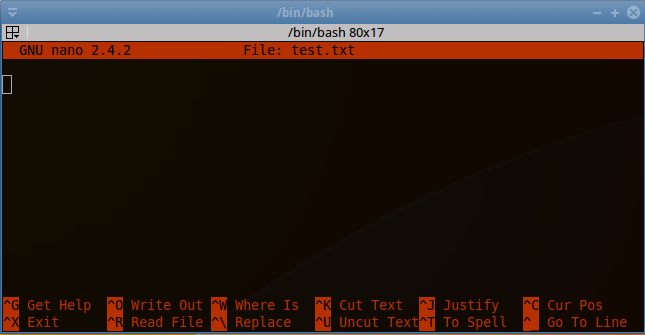

# Preliminaries

## nano

For our class, you will want to install `nano`, which is perhaps the friendliest terminal-based text editor.  To do this in your ubuntu VM, you can enter:

```bash
sudo apt-get install nano
```

## vi and emacs

It's practically a guarantee that every Linux/BSD/UNIX machine you ever touch will have `vi` on it.  This is one of the reasons for its tremendous popularity.  But you may also wish to install the "improved" version, `vim`:

```bash
sudo apt-get install vim
```

The other big text editor is `emacs`.  In the 90's, there were numerous `vim` vs `emacs` internet wars. 

If you plan to work anywhere near cloud computing or big data, I really can not stress to you the importance of learning one of these big text editors.  You are going to be at a *tremendous* disadvantage if you don't.  

So which should you pick?  The truth is it almost doesn't really matter.  Each has pros and cons, but you can generally accomplish whatever you like in one or the other.  `emacs` has the famous Emacs Speaks Statistics (ESS) plugin, which might be convenient if you have to use combinations of R, Stata, SAS, ... .  But `vi` is perfectly capable of handling statistics workflows (and in fact is the editor of choice of the author).  Read up on them, and just pick one.  If you have a friend proficient in one, pick that one.  Whichever you pick, you will need to go into it with an open mind, accept that it is bizarre and alien to you, and master it anyway.  In a few years, you'll wonder how you ever got on without it.  Trust me.

We will not require either `vi`/`vim` or `emacs` for this course.


# Using nano

`nano` mostly works like the text editors you are familiar with.  From the terminal, type

```bash
nano test.txt
```

You will now be using the nano editor.  At the bottom, you will see a list of commands:



Here, the `^` character means `ctrl`.  So to exit, we could enter `ctrl`+`x`.

You can edit text as you would with a simple editor you are familiar with, for example, notepad on Windows.  Enter some text, and save it by entering `ctrl`+`o`.  You will be asked which file name to write to.  By default, the current file is suggested.  Press enter, then `ctrl`+`x` to quit.  You can see the contents of your file by entering

```bash
cat test.txt
```

in the terminal.  That's pretty much it!  You can of course edit existing files with the same workflow.
