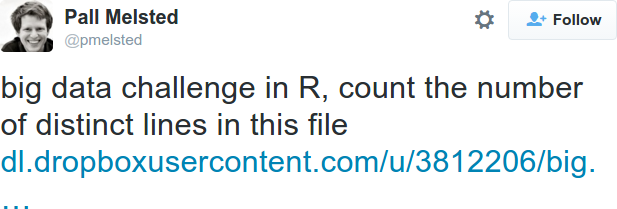

```{r, echo=FALSE, message=FALSE}
library(knitr)
opts_chunk$set(cache=TRUE, fig.align="center", fig.width=5, fig.height=3)
```


##
### The Next 3 Classes
1. Shell basics (today)
2. Shell scripting
3. wrapup + git


# Introduction

##
### Today's Learning Objectives
* Gain some historical perspective.
* Become acquainted with basic interactions with the shell.
* Learn basic system monitoring.
* Discuss file manipulation.
* Introduce the standard pattern tools (`awk`/`sed`/`grep`)


##
### On Learning
\begin{center}
  \begin{minipage}[c]{.75\textwidth}
      \textit{In mathematics, you don't understand things. You just get used to them.}
  \end{minipage}
  \begin{minipage}[c]{0.2\textwidth}
    \begin{center}
      \includegraphics[width=.95\textwidth]{../pics/jvn.jpeg}
    \end{center}
  \end{minipage}
\end{center}


##
### Some Dates
* UNIX: Bell labs, 1970
* GNU: MIT, 1983
* Linux: University of Helsinki, 1991


##
### The GNU Perspective...
\begin{wrapfigure}{r}{0.4\textwidth}
  \begin{center}
    \includegraphics[width=.3\textwidth]{../pics/rms-bw.jpeg}
  \end{center}
\end{wrapfigure}
\textit{I’d just like to interject for a moment. What you’re refering to as Linux, is in fact, GNU/LInux, or as I’ve recently taken to calling it, GNU plus Linux. Linux is not an operating system unto itself, but rather another free component of a fully functioning GNU system made useful by the GNU corelibs, shell utilities and vital system components comprising a full OS as defined by POSIX.}


##
### The Confusion
* "Linux"
* Mac OS X
* FreeBSD, OpenBSD, NetBSD, ... ("the BSD's")
* Solaris


##
### It's So Old! Why Now?
* Free (beer/speech)
* Powerful
* Multi-user by design.
* Great for servers and batch computing.
* Guess what big data needs...


##
### Example Use Cases
* Servers --- persistence (data consumption)
    * Grab data from a service periodically (e.g., scraping twitter)
    * Running a database
* Batch Computing --- long running jobs (data analysis)
    * data mining
    * statistical modeling


##
### Why Even Bother? I know R/Python/...



##
### The Right Tool for the Job

```bash
du -h big.txt
## 41M	big.txt

time sort -u big.txt | wc -l
## 1048576
## 
## real	0m2.472s
## user	0m6.068s
## sys	0m0.128s
```


# Basics

##
### Some Basics
* No drive letters (yay!)
* No registry (YAY!)
* \emph{Everything} is a file.
* Multi-user design.
* `#` is a comment; text that follows is ignored$^{*}$


##
### Getting Help --- `man`
* Manual --- built in help
* Useful for identifying flags
* Often not well-written...
```bash
man ls
```

##
### Getting Help --- The Internet
* search engine
* stackoverflow
* Phrases: 
    * shell
    * scripting
    * bash
    * linux


##
### Searching
* Many programs (`man`, `less`, `vim`, ...) use `/` to search.
* Example: start `man ls` and enter: `/disable`
* Find next match: `n`
* Find previous match: `N`


##
### Permissions
* root --- has access to everything
* regular user does not:
* Also group permissions (beyond scope)
* Some users have root-like access via `su` and/or `sudo`
    * In Ubuntu, `sudo su` changes to root
    * **BE CAREFUL WHEN RUNNING COMMANDS AS ROOT**


##
### Installing Software
* If you have access to root/`sudo`: *very* easy!
* If you don't, often must build from source (can be hard!)


##
### Example (Ubuntu)
```bash
tree # not installed!
sudo apt-get update
# enter your password when prompted...
sudo apt-get install tree
tree
```


##
### Interacting with the Shell
* Tab auto-fills and/or shows options
* Tab once: complete if possible, otherwise do nothing
* Tab twice: show possibilities


##
### Making Things Case Insensitvie
* (Linux Only!): To make your shell case-insensitive.
* Macs already do this by default.

```bash
if [ ! -a ~/.inputrc ]; then
  echo "\$include /etc/inputrc" > ~/.inputrc
fi

echo "set completion-ignore-case On" >> ~/.inputrc
```


##
### Flags and Options
* Passing arguments to a function/command
  * Flags: `-` 
  * Options: `--`
* Similar behavior, different interpretation.
* Often a command has a flag and an argument to do the same thing!
* Rough translation:
    * R: `foo(option=3, f=TRUE)`
    * Shell: `foo -f --option 3`


##
### Why the Multiple Syntax?
* Flags are always a single character.
* Multiple charcaters interpreted as multiple flags!
* `ls -la` same as `ls -al` same as `ls -l -a` 


# System Monitoring

##
### Storage Space
\begin{center}
  \begin{tabular}{ll}\hline
    \textbf{Command} & \textbf{what it does} \\\hline
    du & Disk Usage of folder or current dir \\
    df & File system report \\
  \end{tabular}
\end{center}


##
### Example
```bash
du /tmp
df
df -h
```


##
### Processes
\begin{center}
  \begin{tabular}{ll}\hline
    \textbf{Command} & \textbf{what it does} \\\hline
    top & Show top running processes \\
    ps & process information \\
    kill & Terminate a process \\\hline
  \end{tabular}
\end{center}


##
### Example
```bash
top
ps 12345
kill 12345
```


# Working with Files
##
### Managing Files

\begin{center}
  \begin{tabular}{ll}\hline
    \textbf{Command} & \textbf{what it does} \\\hline
    ls & list folder contents \\
    cd & change directory \\
    rm & remove file/dir \\
    touch & create empty file \\
    cp & copy file/dir \\\hline
  \end{tabular}
\end{center}


##
### Example
```bash
ls
mkdir mydir
touch myfile
ls
rm myfile
rm mydir
rm -r mydir
```


##
### Paths
* Separated by `/`
* Relative: `dir1/dir2`
* Absolute: `/home/user/dir1/dir2`

\begin{center}
  \begin{tabular}{ll}\hline
    \textbf{Command} & \textbf{what it does} \\\hline
    \texttt{pwd} & Print working directory \\
    \texttt{.} & Here \\
    \texttt{..} & One directory up \\
    \texttt{$\sim$} & Home \\
  \end{tabular}
\end{center}


##
### Dir Dots
* `.` --- current working directory
* `..` --- parent working directory
* `...` --- **not valid**! Means nothing
* `../..` --- parent of parent directory
* `../../..` --- parent of parent of parent directory
* etc.


##
### Example
```bash
cd ~
mkdir examples
cd ~/examples
pwd
```


##
### Hidden Files
* Files beginning with `.` are "hidden"
* See them with `ls -a`


##
### Example
```bash
ls
touch .example
ls
ls -l
rm .example
```


##
### Interacting with Files
\begin{center}
  \begin{tabular}{ll}\hline
    \textbf{Command} & \textbf{what it does} \\\hline
    `head` & see first few lines of file \\
    `tail` & see last few lines of file \\
    `cat` & "concatenate" \\
  \end{tabular}
\end{center}


##
### Example
```bash
head /etc/passwd
tail /etc/passwd
cat /etc/passwd
```


# Pipes and Redirection
##
### Pipes
* `|` (`shift`+`\` on American keyboards)
* Chains together multiple commands
* Works like function composition:
    * R: `foo(bar(x))`
    * Shell: `bar x | foo`
* Flags/options rules still apply:
    * `foo(bar(x, f=TRUE), option=3)`
    * `bar x -f | foo --option 3`


##
### Example
```bash
ls -l ~ | tail
ls -l ~ | tail -n 2
```


##
### Redirection
\begin{center}
  \begin{tabular}{ll}\hline
    \textbf{Symbol} & \textbf{what it does} \\\hline
    $>$ & redirect (overwrite) \\
    $>>$ & redirect (append)
  \end{tabular}
\end{center}


##
### Example
```bash
echo "some text" > myfile
echo "some text" >> myfile
```


# awk/sed/grep

##
### awk, sed, and grep
* grep
    * Global Regular Expression Printer
    * search text for lines containing a pattern
* sed
    * Stream EDitor
    * operations on lines
* awk
    * Named after its authors (Aho, Weinberger, Kernighan)
    * operations on columns
* Useful exploratory/preprocessing tools


##
### grep: Your New Best Friend
* Tool for searching text files with complex patterns.
* ***EXTREMELY USEFUL***
* More advanced features next time
* My 5 Most Used Commands (descending order)
    * cd
    * ls
    * git
    * vim
    * grep


##
### Searching? Really?
* Uses regular expressions
* Very fast
* Doesn't load files into memory!


##
### Regular Expressions
* Concise encapsulation of patterns
* Look like the result of a cat stomping on your keyboard.
    * `/^$/d`
    * `/^$/{p;h;};/./{x;/./p;}`
* sed and grep use these
* awk is a little different...


##
### Regular Expressions
\begin{center}
  \includegraphics{../pics/perl.png}
\end{center}


##
### grep: Just the Basics
* `grep pattern file`
* `grep -v anti_pattern file`
* `some_cmd | grep pattern`
* `grep pattern | grep -v anti_pattern`


##
### Example
```bash
grep bash /etc/passwd
grep bash /etc/passwd | grep -v root
```


##
### sed: Just the Basics
* Find and replace
* EXTREMELY POWERFUL
* `sed s/pattern/replacement/`
* `sed s/pattern/replacement/g`
* "Useful One-Line Scripts for sed":  http://sed.sourceforge.net/sed1line.txt


##
### Example
```bash
echo "dog"
echo "dog" | sed s/dog/cat/
echo "a b a c a b b" | sed s/a//g
```


# Closing

##
### Putting It All Together
* How do we use this stuff!?
* Next time!
* Great for small/medium sized data
* Sometimes acceptable for large-ish data


##
### Homework
* On Blackboard
* Due in 1 week
* Another will be given Wednesday, also due Monday
